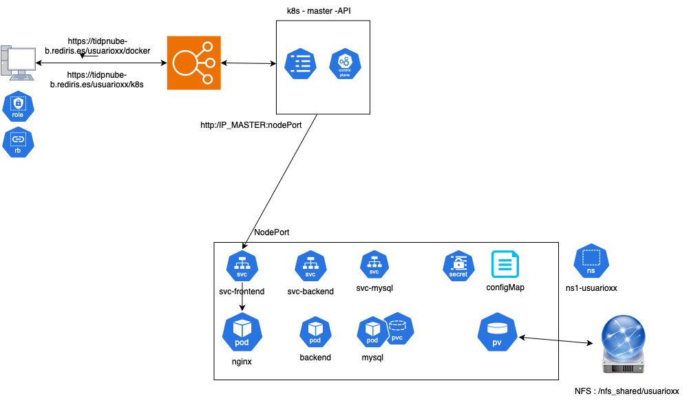

# Práctica kubernetes

## Arquitectura



## 1. Desglose de los Componentes y el Orden de Ejecución en un Despliegue de Kubernetes

### Namespace (Espacio de Nombres)
- **Importancia**: Aunque para esta práctica inicial todos los recursos (front-end, back-end, y base de datos) se desplegarán en un solo namespace, es importante comprender el concepto de namespaces. Los namespaces permiten dividir los recursos de un clúster para mejorar la organización, aplicar políticas de seguridad, y gestionar recursos de forma aislada. Esto es útil para entornos de desarrollo y producción, o para gestionar diferentes aplicaciones dentro del mismo clúster.
- **En esta práctica**: Utilizaremos un solo namespace (**ns1-usuarioxx**), donde todos los componentes se ejecutarán. Más adelante, podrás experimentar separando estos recursos en dos namespaces distintos (**ns1-usuarioxx y ns2-usuarioxx**) para observar cómo afecta la gestión y la comunicación.
- **Uso**: Cuando avances a la práctica de separación, podrás ver cómo los namespaces afectan la comunicación entre componentes y cómo se pueden aplicar políticas de seguridad específicas por namespace.

## ConfigMaps
- **Importancia**: Los ConfigMaps son fundamentales para proporcionar configuraciones no confidenciales a las aplicaciones de manera centralizada y flexible. Te permiten modificar parámetros de tu aplicación (como URLs, rutas de API, o configuraciones específicas) sin tener que reconstruir las imágenes de los contenedores. Esto es especialmente valioso cuando trabajas en entornos dinámicos o necesitas realizar ajustes rápidos.
- **En tu despliegue**: En este taller crearemos 3 configmaps diferentes: uno para configurar el frontend, otro para configurar el backend y un último fiechero de configuración para provisionar la base de datos
- **Orden de Ejecución**: Los ConfigMaps deben crearse antes de desplegar cualquier aplicación que dependa de ellos, ya que las aplicaciones podrían no arrancar correctamente si la configuración no está disponible.

## Persistent Volume (PV) y Persistent Volume Claim (PVC)
- **Importancia**: El almacenamiento persistente es crucial para aplicaciones como bases de datos, que necesitan guardar información más allá del ciclo de vida de un pod. El PV representa un recurso de almacenamiento en el clúster, y el PVC es la solicitud de ese almacenamiento. Usar PV y PVC asegura que los datos no se pierdan, incluso si el pod que ejecuta la base de datos se reinicia o se elimina.
- **En tu práctica**: La base de datos utilizará un PVC para asegurarse de que el almacenamiento esté garantizado y disponible, manteniendo la persistencia de los datos.
- **Orden de Ejecución**: Debes configurar el PV y PVC antes de desplegar la base de datos, de modo que esta tenga acceso inmediato al almacenamiento cuando se ejecute.

## Deployments y Servicios
- **Deployments**: Los deployments en Kubernetes definen cómo se despliegan y gestionan los contenedores de tus aplicaciones. Se encargan de mantener el número deseado de réplicas en ejecución, gestionar actualizaciones de manera controlada, y manejar la recuperación de fallos.
  - **Front-end (Nginx)**: Este componente se encarga de servir la interfaz de usuario y normalmente se expone al exterior mediante un servicio de tipo NodePort, permitiendo el acceso desde fuera del clúster.
  - **Back-end**: Procesa la lógica de negocio y maneja la comunicación con la base de datos. Solo se necesita exponerlo internamente dentro del clúster para que el front-end pueda comunicarse con él.
  - **Base de Datos**: Es el componente que almacena los datos de manera persistente. Normalmente no se expone al exterior y solo es accesible internamente por el back-end.
- **Servicios**: Los servicios en Kubernetes gestionan el tráfico y exponen las aplicaciones de manera adecuada.
  - **NodePort**: Se utiliza para exponer el servicio de Nginx externamente.
  - **ClusterIP**: Se usa para el back-end y la base de datos, permitiendo la comunicación interna dentro del clúster.
- **Orden de Ejecución**:
  - Desplegar la base de datos primero para asegurarse de que esté operativa antes de que el back-end intente conectarse.
  - Luego desplegar el back-end, asegurando que pueda conectarse y comunicarse correctamente con la base de datos.
  - Finalmente, desplegar el front-end (Nginx), que se conecta al back-end y proporciona la interfaz de usuario.

## Políticas de Red (Network Policies)
- **Importancia**: Las políticas de red son cruciales para la seguridad del clúster, ya que permiten definir y restringir el tráfico entre los pods. Esto ayuda a proteger los datos sensibles (por ejemplo, restringiendo el acceso a la base de datos) y a asegurar que solo los componentes autorizados puedan comunicarse entre sí. Es una medida clave para evitar accesos no autorizados y proteger tu aplicación.
- **En tu despliegue actual**: Puedes configurar las políticas para permitir que el front-end solo se comunique con el back-end y que el back-end sea el único que acceda a la base de datos. Aunque no es necesario para el despliegue inicial, es importante para entender cómo asegurar el tráfico en un entorno de producción.
- **Orden de Ejecución**: Las políticas de red deben aplicarse al final, una vez que hayas desplegado y confirmado que todos los componentes funcionan correctamente. De esta manera, puedes verificar la conectividad antes de restringir el tráfico.

## Orden de Ejecución Recomendado
1. **Crear el namespace único** (inicialmente), donde todos los componentes se desplegarán.
2. **Aplicar los ConfigMaps** para asegurar que las configuraciones estén disponibles antes de desplegar las aplicaciones.
3. **Configurar y aplicar el PV y PVC** para que la base de datos tenga almacenamiento persistente.
4. **Desplegar el deployment y servicio de la base de datos**, asegurando que esté lista antes de que los demás componentes intenten conectarse.
5. **Desplegar el deployment y servicio del back-end**, garantizando que pueda conectarse a la base de datos.
6. **Desplegar el deployment y servicio del front-end (Nginx)**, asegurando que pueda comunicarse con el back-end.
7. **Aplicar las políticas de red** para asegurar y restringir el tráfico entre los pods.

## Cambios previos 

1- De todos los ficheros de configuracion que te encuentras en el directorio k8s/config debes moficar el nombre del namespaces acorde al asignado. Ejemplo:

```
apiVersion: apps/v1
kind: Deployment
metadata:
  name: mysql-deployment
  namespace: ns1-usuarioxx
```
Lo mismo para los ficheros de configuración dentro de k8s/config/namespace2

```
apiVersion: apps/v1
kind: Deployment
metadata:
  name: mysql-deployment
  namespace: ns2-usuarioxx
```

2- Crear el pv y pvc - cambiar el nombre, namespace (solo en el PVC) y el hostPath

```
apiVersion: v1
kind: PersistentVolume
metadata:
  name: mysql-pv- # Cambiar por el numero de usuario
  labels:
    name: mysql-pvc-  # Cambiar por el numero de usuario
spec:
  capacity:
    storage: 50Mi
  accessModes:
    - ReadWriteOnce
  hostPath:
    path: "/nfs_share/usuarioxx"  # Cambia esto a un directorio local en tu sistema
```

3- Modificar el volumen de la instancia de la BBDD

```
volumes:
      - name: mysql-storage
        persistentVolumeClaim:
          claimName: mysql-pvc-xx # Cambiar por el numero de usuario
```

4-El servicio del frontend. Se debe poner el nodeport asociado al numero asignado de usuario. Ejemplo: **usuario 01 -> nodeport: 30001; usuario 20 -> nodeport 30020**

```
  - port: 80
      targetPort: 80
      nodePort: 30080  # Especifica un NodePort fijo
```

5- los ficheros que coincidan en el directorio namespace2. Hacer lo mismo

## Desplegamos los ficheros siguiendo el orden recomendado 

1. **Crear el namespace único**. Para esta práctica, los namespaces ya estan creados y son privados para cada uno de los usuarios. Cada usuario tiene 2:

	```
	ns1-usuarioxx
	ns2-usuarioxx
	
	#Si se desea cambiar de namespace: 
	kubens ns1-usuarioxx
	kubens ns2-usuarioxx
	```

2. **Aplicar los ConfigMaps y secretos** 

	```
	kubectl apply -f configMaps.yaml
	kubectl apply -f secrets.yaml
	```
3. **Configurar y aplicar el PV y PVC** 

	```
	kubectl apply -f pv-y-pvc.yaml
	```

4. **Desplegar el deployment y servicio de la base de datos**

	```
	kubectl apply -f deployment-bbdd.yaml
	
	# Y ahora el servicio para exponerlo. 
	
	kubectl apply -f service-ddbb.yaml
	```
5. **Desplegar el deployment y servicio del back-end**

	```
	kubectl apply -f deployment-backend.yaml
	
	kubectl apply -f service-backend.yaml
	```

6. **Desplegar el deployment y servicio del front-end (Nginx)**

	```
	kubectl apply -f deployment-frontend.yaml
	
	kubectl apply -f service-frontend.yaml
	```
	
7. **Aplicar las políticas de red**: Aquí vamos a ir paso a paso para darnos cuenta de como influyen.


8. Antes de ir a las políticas de red podemos probar el acceo a la aplicación. Cambiando el número del usuario


	[https://tidpnube-b.rediris.es/usuarioxx/k8s/](https://tidpnube-b.rediris.es/usuarioxx/k8s/)

En la aplicacion tenemos diferentes accesos:

	1.1 https://tidpnube-b.rediris.es/usuarioxx/k8s/ (RAIZ)
	1.2 https://tidpnube-b.rediris.es/usuarioxx/k8s/data (vemos el resultado de lo que contiene la bbdd)
	1.3 https://tidpnube-b.rediris.es/usuarioxx/k8s/usuario (genera un usuario aleatorio)
	1.4 https://tidpnube-b.rediris.es/usuarioxx/k8s/health (comprueba el estado de la app)
	

##Políticas de red

1. Como hemos comprobado ahora todo debería funcionar 
2. Aplicamos la regla de bloqueo de todo el tráfico al namespace. 

	```
	kubectl apply -f netpol-1-block-all-traffic.yaml
	```
Comprobamos que no se puede acceder
3. Permitimos tráfico desde el exterior al pod nginx por el puerto 80 y tráfico entre pods del mismo namespace

	```
	kubectl apply -f netpol-2-allow-external.yaml
	kubectl apply -f netpol-3-conn-into-ns.yaml
	```

	Para probar esta regla tambien podemos permitir un puerto diferente al 80 (por ejemplo el 8080)y veremos que no podemos acceder porque el 80, que es donde esta escuchando nginx, no esta permitido.

####Ahora es hora de separar el despliegue en namespaces y de esta forma aislamos un poco más. 
Vamos a pasar el frontend al namespace 2 y ahi lo exponemos

1. Borramos el frontend y servicio del namespace 1

	```
	kubectl delete -f deployment-frontend.yaml
	kubectl delete -f service-frontend.yaml
	```
	En este momento ya no tenemos frontal y no podemos acceder. 
	
2. Desplegamos los mismos configMaps, deployment y service que teniamos en el namespace 1 pero en el 2 

	```
	kubectl apply -f namespace_2/configMaps.yaml
	kubectl apply -f namespace_2/deployment-frontend.yaml
	kubectl apply -f namespace_2/service-frontend.yaml
	```
	
	No hay politicas de red y en cambio ¿Podemos entrar? En estos momementos no. Porque no tenemos conexión con el backend. pero el backend esta bien configurado:
		 
	####Observación: Mirar el nuevo configMap el backend ha cambiado. Esta es la forma que se tiene de utilizar la resulución a nivel interno en el clúster
	
3. Añadimos políticas de red: Todas son las mismas que para el namespace 2 

	```
	kubectl apply -f namespace_2/netpol-1-block-all-traffic.yaml
	kubectl apply -f namespace_2/netpol-2-allow-external.yaml
	kubectl apply -f namespace_2/netpol-3-conn-into-ns.yaml
	```
	Pero asi seguimos sin poder entrar. La conexión con el backend sigue bloqueda. **Vamos a crear una regla para permitir el tráfico al backend desde el nginx del ns2**
	
	```
	kubectl apply -f netpol-4-conn—from-other-ns.yaml
	```
	
Ahora deberíamos poder verlo todo sin problema en la misma URL: 

	1.1 https://tidpnube-b.rediris.es/usuarioxx/k8s/ (RAIZ)
	1.2 https://tidpnube-b.rediris.es/usuarioxx/k8s/data (vemos el resultado de lo que contiene la bbdd)
	1.3 https://tidpnube-b.rediris.es/usuarioxx/k8s/usuario (genera un usuario aleatorio)
	1.4 https://tidpnube-b.rediris.es/usuarioxx/k8s/health (comprueba el estado de la app)
	

# Práctica: Actualizando configuraciones

Aquí tienes una práctica completa paso a paso para realizar un rollout en Kubernetes cambiando la versión de la imagen del Deployment, utilizando dos métodos: modificando el archivo `deployment.yaml` y usando `kubectl set image`. También se mostrará cómo verificar el estado del rollout y los pods, y cómo acceder a la aplicación web para confirmar el cambio.

---

## Paso 1: Cambiar la versión de la imagen

Tenemos dos opciones. modifiando el yaml o cambiando la imagen directamente. Elige la que quieras.

### Opción 1: Modificar `deployment-backend.yaml`
1. Abre tu archivo `deployment-backend.yaml` y localiza la especificación de la imagen:

   ```yaml
   apiVersion: apps/v1
kind: Deployment
metadata:
  name: backend-deployment
  namespace: ns1-usuario01
spec:
  replicas: 1
  selector:
    matchLabels:
      app: backend
  template:
    metadata:
      labels:
        app: backend
    spec:
      containers:
      - name: backend
        image: back-taller:1.0  # Nuestra img creada
        ports:
        - containerPort: 5000
        env:
       ....
   ```
2. Cambia la versión de la imagen, por ejemplo, de `back-taller:1.0` a `back-taller:2.0`:

   ```yaml
   image: back-taller::2.0  # Nueva versión de la imagen
   ```
3. Guarda el archivo y aplica el cambio:

   ```bash
   kubectl apply -f deployment-backend.yaml
   ```

---

### Opción 2: Usar `kubectl set image`
1. Ejecuta el siguiente comando para actualizar la imagen sin modificar el archivo YAML:

   ```bash
   set image deployment/backend-deployment backend=back-taller:2.0
   ```

  - `deployment/backend-deployment`: Especifica el nombre del Deployment.
  - `backend`: El nombre del contenedor que quieres actualizar.
  - `back-taller:2.0`: La nueva versión de la imagen.

---

## Paso 2: Verificar el estado del rollout
1. Usa el siguiente comando para ver el progreso del rollout:

   ```bash
   kubectl rollout status deployment/backend-deployment
   ```

   Esto te mostrará si el rollout se está ejecutando correctamente o si hay algún problema.

---

## Paso 3: Verificar los pods
1. Lista los pods y observa el estado de los pods antiguos y los nuevos:

   ```bash
   kubectl get pods
   ```

   Esto debería mostrar los pods en diferentes estados, como `Terminating` para los antiguos y `Running` para los nuevos. Espera a que todos los nuevos pods estén en estado `Running`.

2. Si deseas obtener más detalles de un pod específico, puedes usar:

   ```bash
   kubectl describe pod <nombre-del-pod>
   ```

---

## Paso 4: Acceder a la aplicación web para confirmar el cambio

Cambia tu número de usuario y oberseva la actualización de la imagen en la aplicación desplegada

```bash
https://tidpnube-b.rediris.es/usaurioxx/k8s
```


# Práctica: Ahora cambiamos la configuración de la app 

En esta práctica, cambiarás la configuración de un `ConfigMap` y un `Secret`, aplicarás los cambios, harás un `rollout restart` para recargar la configuración, y registrarás una descripción en el historial de rollouts usando la opción `--record`.

---

## Paso 1: Cambiar la Configuración en un `ConfigMap` y un `Secret`

1. **Edita el `ConfigMap`**:

   ```bash
   kubectl get configmap
   kubectl edit configmap backend-configmap
   
   o bien editamos el fichero configMaps.yamly aplicamos cambios
    
   ```
   - Realiza los cambios necesarios y guarda.

2. **Edita el `Secret`**:

   ```bash
   kubectl edit secret mi-secret
   ```
   - Realiza los cambios y guarda.

---

## Paso 2: Aplicar los Cambios y Hacer un `rollout restart` con Registro

1. **Aplica los cambios si usas archivos YAML**:

   ```bash
   kubectl apply -f configMaps.yaml
   kubectl apply -f secrets.yaml
   ```

2. **Hacer un `rollout restart` con la opción `--record`**:

   ```bash
   kubectl rollout restart deployment/backend-deployment
   
   Guardamos el regitro: 
   
   kubectl annotate deployment/backend-deployment kubernetes.io/change-cause="Actualización del ConfigMap"
   
   ```
---

## Paso 3: Verificar el Estado y Acceder a la Aplicación

1. **Verifica el estado del rollout**:

   ```bash
   kubectl rollout status deployment/mi-app
   ```

2. **Observa los pods**:

   ```bash
   kubectl get pods
   ```
   - Asegúrate de que todos los pods estén en estado `Running`.

3. **Accede a la aplicación web**:
   

---

## Paso 4: Ver el Historial de Rollouts

1. **Muestra el historial de rollouts**:

   ```bash
   kubectl rollout history deployment/backend-deployment
   ```
   - Ahora deberías ver una descripción del cambio gracias a la opción `annotate`.

#Equivocándonos y echando marcha atrás

# Práctica: Rollout con Imagen Incorrecta y Anotación en Kubernetes

En esta práctica, cambiarás la imagen en el `deployment.yaml` a una versión incorrecta, aplicarás los cambios, agregarás una anotación para registrar la causa, y demostrarás cómo Kubernetes maneja el fallo sin degradar el servicio. Luego, volverás a un estado anterior con `kubectl rollout undo`.

---

## Paso 1: Cambiar la Imagen en el `deployment-backend.yaml` a una Versión Incorrecta

1. Abre tu archivo `deployment-backend.yaml` y cambia la imagen a una versión que no exista:
   
2. Guarda el archivo y aplica los cambios:

   ```bash
   kubectl apply -f deployment-backend.yaml
   ```

3. **Añade una anotación para registrar la causa del cambio**:

   ```bash
   kubectl annotate deployment/backend-deployment kubernetes.io/change-cause="Intento de actualizar a una imagen inexistente para demostrar rollback"
   ```

---

## Paso 2: Verificar el Estado del Rollout

1. Observa el estado del rollout para ver que hay un problema al descargar la imagen:

   ```bash
   kubectl rollout status deployment/backend-deployment
   ```
   - Se visuzaliza que todavia esta pending. El despliegue mostrará un error indicando que no puede descargar la imagen. 

2. **Verifica que el servicio no se degrada**:
   - El servicio seguirá utilizando los pods antiguos en ejecución, manteniendo la aplicación web funcionando.
   - Puedes comprobar los pods con:

     ```bash
     kubectl get pods
     ```
   - Verás que los pods nuevos no se inician, pero los antiguos siguen corriendo y manteniendo el servicio disponible.

---

## Paso 3: Volver a un Estado Anterior con `kubectl rollout undo`
1. Vemos los cambios realizados

	```
	kubectl rollout history deployment/backend-deployment  -n ns1-usuario01
	```
2. Usa el siguiente comando para revertir el Deployment al estado anterior o una especifica:

   ```bash
   kubectl rollout undo deployment/backend-deployment
   
   kubectl rollout undo deployment/backend-deployment --to-revision=<numero-de-revision>

   ```
3. **Verifica el estado del rollback**:

   ```bash
   kubectl rollout status deployment/backend-deployment
   ```
   - El despliegue volverá a la versión anterior de la imagen que funcionaba correctamente.

4. **Verifica los pods**:

   ```bash
   kubectl get pods
   ```
   - Ahora deberías ver que los pods antiguos se han vuelto a desplegar correctamente y están en estado `Running`.

Y despues de un intento fallido, el servicio no se ha degradado y ha seguido funcionando 
---

### Paso 4: Acceder a la Aplicación Web y Confirmar

